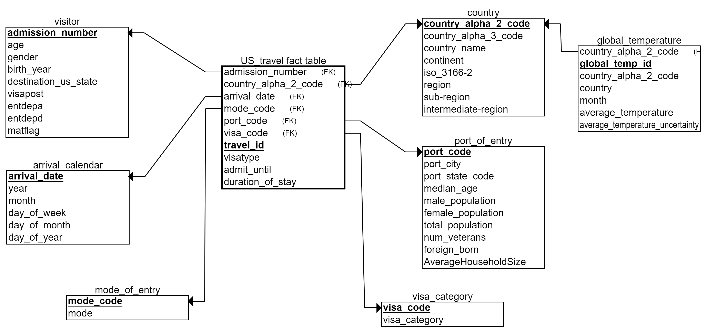

# Data-Engineering-Capstone-Project
Udacity Data Engineering Capstone Project

# US Travel Insights 

#### Project Summary
Every year people travel to US cities for various reasons which include business, pleasure and studies. In general there are two categories of travelers 1) domestic and 2) international. In this project, I will be mainly focusing on international travelers and gather data that can facilitate the process of gaining insights on these international travelers. Basically, will try to create a database that can be used to analyze US travel patterns (International travels). 

The goal is for a Data Analyst/Data Scientist to use this database in order to quickly gain further insights on these international travelers. Some analysis that can be performed include 
* Finding insights on age group of the travelers
* Traveler's country of citizenship/residence --> Number of travelers by country
* Duration of stay of these travelers
* Travelers preferrred port of entry
* Months with most number of international travelers visiting US
* Forecast future travel pattern of international travelers
* Analyze the correlate climate/temperature (for a specific month) in the country of origin of these travelers and the month they visit US.

In general, the project follows the following steps:
* Step 1: Scope of the Project and Data Considered
* Step 2: Explore and Assess the Data
* Step 3: Define the Data Model
* Step 4: Run ETL to Model the Data
* Step 5: Project Write Up

### Step 1: Scope of the Project and Gather Data

#### Scope 
In this project, I plan to create a database that can be used to analyze US travel patterns, specifically, international travels to US. Using the identified raw data, I will be creating fact and dimensions tables that will facilitate the analysis that can be performed to understand US travel patterns. In general the scope of the project is to create ETL pipeline for processing, cleaning and storing data related US travel patterns. The database will be modeled using Star Schema model as it allows for better query performance.

Expected end solution:
* Expected fact table: US_travel
* Expected dimensions tables: visitor, arrival_calendar, mode_of_entry, visa_category, port_of_entry, country, global_temperature (secondary dimension table)

Tools used:
* SPARK (alternatively could use SPARK instance on AWS EMR)
* PYTHON
* Local storage (alternatively could use S3 storage)

#### Describe and Gather Data 
The datasets used in the project are as follows:

* **I94 Immigration Data**: This data comes from the US National Tourism and Trade Office. (Link: https://www.trade.gov/national-travel-and-tourism-office)
* **World Temperature Data**: This dataset came from Kaggle. (Link: https://www.kaggle.com/berkeleyearth/climate-change-earth-surface-temperature-data)
* **U.S. City Demographic Data**: This data comes from OpenSoft. (Link: https://public.opendatasoft.com/explore/dataset/us-cities-demographics/export/)
* **Airport Code Table**: This is a simple table of airport codes and corresponding cities. (Link: https://datahub.io/core/airport-codes#data)
* **i94cnty, i94addr, i94mode, i94prt, i94visa**: These data were extracted from the data dictionary included in the workspace
* **ISO-3166-Countries-with-Regional-Codes**: Data containing ISO country codes with regional codes. (Link: https://github.com/lukes/ISO-3166-Countries-with-Regional-Codes/tree/master/all) 
* **IP2LOCATION-ISO3166-2**: Data containing IP2Location™ ISO 3166-2 Subdivision Code. (Link: https://www.ip2location.com)

### Step 2: Explore and Assess the Data
#### Explore the Data 
All the data was explored and several issues were identified and steps were taken to fix these issues.

#### Cleaning Steps
The following steps were followed in order to clean the data:
* Check for percentage of missing values across all the features in the data --> Filter out features with mostly missing values
* Typecast some features to an appropriate data type
* Check string type features for for trailing spaces. Remove these spaces.
* Check for duplicates and remove the duplicates
* For some features impute missing values
* Standardize some features (e.g. country name)
* Save cleaned data in a directory (staging data)

### Step 3: Define the Data Model
#### 3.1 Conceptual Data Model
The database was modeled using Star Schema model which consists of 1 Fact table, 6 Dimension tables and 1 Secondary Dimension table. Star schema was selected for following reasons:
* Improved query performance
* Faster load performance
* Can be easily understood by data analyst

Proposed Data Model:

#### 3.2 Mapping Out Data Pipelines
Steps necessary to pipeline the data into the chosen data model:
* Load data (e.g. from local or Amazon S3)
* Clean the data (handle missing values, data type, standardize features)
* Save preprocessed and cleaned table as staging table
* Load data from staging table
* Extract relevant features to create dimension tables and fact table
* Perform quality checks on the dimensions and fact tables
* If it passed quality checks, store the tables (e.g. as parquet, csv, etc. on Amazon S3 or local)

### Step 4: Run Pipelines to Model the Data 
#### 4.2 Data Quality Checks
Data quality checks that will be performed include:
* Checking whether records are being inserted in the dimension and fact tables
* Validate whether the primary key is unique for the tables
* While exteacting features, extra care will be taken to remove duplicate records

#### Step 5: Project Write Up
* Rationale for the choice of tools and technologies for the project:
    * Apache SPARK was used because of its ability to handle Big Data, multiple file formats, offers a lightning-fast unified analytics engine for big data, easy-to-use APIs
    * PYTHON was used because it has some easy to use libraries and function for processing data
* How often the data should be updated?
    * Assuming new travel records will be available monthly, the data can be updated monthly
* Description on handling different scenarios:
    * The data was increased by 100x
        * Utilize clustered SPARK to enable parallel processing of the data
        * Store the data in a distributed platform like Hadoop or Amazon S3
        * Utilize Amazon EMR
    * The data populates a dashboard that must be updated on a daily basis by 7am every day
        * Utilize Apache Airflow. Schedule the script to run daily and complete by 7am every day
    * The database needed to be accessed by 100+ people
        * Migrate the database to Amazon Redshift. This will ensure that the database to be accessed by many people.
        * Ensure that the tables are created in such a way that it can perform queries by various people faster and efficiently

